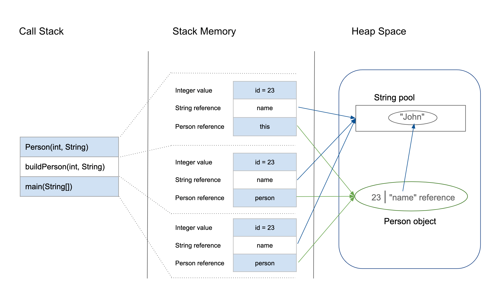

# [The Complete Java Certification Course](https://www.udemy.com/course/master-practical-java-development/)

Completing this course a refresher on Java basics and to properly learn some of the more complex topics.
I will not be writing notes and code from the very basics, that is just redundant. 

## Lecture 12: Java Stack + Heap with Reference Variables

There are two memory locations which becomes reserved for the Java application to run successfully, the stack and
the heap.

### Stack

When the Java Application is run, each method invocation is added to the stack from the bottom up within a stack frame.
Every method invocation is added on top of the previous frame, and is removed from the top of the stack once completed.

### Heap

  

[source - Baeldung](https://www.baeldung.com/java-stack-heap)